CC2 : Phyloseq analysis
================

  - [Chargement des images de dada2](#chargement-des-images-de-dada2)
  - [Arbre phylogénétique](#arbre-phylogénétique)
  - [Alpha diversité](#alpha-diversité)
      - [Filtrage de la taxonomie](#filtrage-de-la-taxonomie)
          - [Indiquer les rangs dans l’ensemble des
            données](#indiquer-les-rangs-dans-lensemble-des-données)
          - [Créer un tableau, nombre de caractéristiques pour chaque
            phyla](#créer-un-tableau-nombre-de-caractéristiques-pour-chaque-phyla)
          - [Créer une table avec le nombre dans chaque
            phyla](#créer-une-table-avec-le-nombre-dans-chaque-phyla)
  - [Construction des arbres
    phylogénétiques](#construction-des-arbres-phylogénétiques)
  - [Abondance](#abondance)
      - [Selon la profondeur](#selon-la-profondeur)
  - [Ordination](#ordination)
      - [Visualisation de l’ordination](#visualisation-de-lordination)
  - [Bar plot](#bar-plot)
      - [Au niveau du Phylum](#au-niveau-du-phylum)
  - [Analyse en réseau](#analyse-en-réseau)

``` r
library(ggplot2)
library(dada2)
```

    ## Loading required package: Rcpp

``` r
library(phyloseq)
library(Biostrings)
```

    ## Loading required package: BiocGenerics

    ## Loading required package: parallel

    ## 
    ## Attaching package: 'BiocGenerics'

    ## The following objects are masked from 'package:parallel':
    ## 
    ##     clusterApply, clusterApplyLB, clusterCall, clusterEvalQ,
    ##     clusterExport, clusterMap, parApply, parCapply, parLapply,
    ##     parLapplyLB, parRapply, parSapply, parSapplyLB

    ## The following objects are masked from 'package:stats':
    ## 
    ##     IQR, mad, sd, var, xtabs

    ## The following objects are masked from 'package:base':
    ## 
    ##     anyDuplicated, append, as.data.frame, basename, cbind, colnames,
    ##     dirname, do.call, duplicated, eval, evalq, Filter, Find, get, grep,
    ##     grepl, intersect, is.unsorted, lapply, Map, mapply, match, mget,
    ##     order, paste, pmax, pmax.int, pmin, pmin.int, Position, rank,
    ##     rbind, Reduce, rownames, sapply, setdiff, sort, table, tapply,
    ##     union, unique, unsplit, which, which.max, which.min

    ## Loading required package: S4Vectors

    ## Loading required package: stats4

    ## 
    ## Attaching package: 'S4Vectors'

    ## The following object is masked from 'package:base':
    ## 
    ##     expand.grid

    ## Loading required package: IRanges

    ## 
    ## Attaching package: 'IRanges'

    ## The following object is masked from 'package:phyloseq':
    ## 
    ##     distance

    ## Loading required package: XVector

    ## 
    ## Attaching package: 'Biostrings'

    ## The following object is masked from 'package:base':
    ## 
    ##     strsplit

``` r
library(DECIPHER)
```

    ## Loading required package: RSQLite

On a appellé les “library” pour lancer nos lignes de codes

# Chargement des images de dada2

``` r
load("~/EcoG2-CC2/02_Dada2_tutorial_FinalEnv")
```

``` r
samples.out <- rownames(seqtab.nochim)
profondeur <- sapply(strsplit(samples.out, "_"), `[`, 2)
profondeur <- (sapply(strsplit(samples.out, "_"), `[`, 3))
date <- substr(profondeur,1,11)
samdf <- data.frame(Profondeur=profondeur, Date=date)
samdf$Profondeur <- c("Fond","Fond","Fond","Fond","Fond", "Median","Median","Surface","Surface","Surface","Surface")
samdf$Date[samdf$Profondeur==11] <- c("mars","sept")
rownames(samdf) <- samples.out
```

Avec le code précédant, les échantillons récupérés ont été divisé en
fonction de la date : le 10 septembre 14 et le 11 mars 2015,
correspondant respectivement à la fin de l’été et la fin de l’hiver. Les
échantillons ont aussi été en fonction de la profondeur : “fond”
“médian” et “surface”. Ce callibrage des échantillons a été mis
dans la variable “samdf”

# Arbre phylogénétique

Les lignes de commandes vont permettre de récréer des arbres
phylogénétiques à partir de nos séquences.

``` r
library(phangorn)
```

    ## Loading required package: ape

    ## 
    ## Attaching package: 'ape'

    ## The following object is masked from 'package:Biostrings':
    ## 
    ##     complement

``` r
library(DECIPHER)
seqs <- getSequences(seqtab.nochim)
names(seqs) <- seqs # This propagates to the tip labels of the tree
alignment <- AlignSeqs(DNAStringSet(seqs), anchor=NA,verbose=FALSE)
phangAlign <- phyDat(as(alignment, "matrix"), type="DNA")
dm <- dist.ml(phangAlign)
treeNJ <- NJ(dm) # Note, tip order != sequence order
fit = pml(treeNJ, data=phangAlign)
```

    ## negative edges length changed to 0!

``` r
fitGTR <- update(fit, k=4, inv=0.2)
fitGTR <- optim.pml(fitGTR, model="GTR", optInv=TRUE, optGamma=TRUE,
        rearrangement = "stochastic", control = pml.control(trace = 0))
detach("package:phangorn", unload=TRUE)
```

Ensuite, dans une nouvelles variable, est assigné grâce à la fonction
phyloseq(), les tables d’OTU sans chimères, les échantillons, la table
taxonomque.

``` r
ps <- phyloseq(otu_table(seqtab.nochim, taxa_are_rows=FALSE), 
               sample_data(samdf), 
               tax_table(taxa), phy_tree(fitGTR$tree))
ps
```

    ## phyloseq-class experiment-level object
    ## otu_table()   OTU Table:         [ 1557 taxa and 11 samples ]
    ## sample_data() Sample Data:       [ 11 samples by 2 sample variables ]
    ## tax_table()   Taxonomy Table:    [ 1557 taxa by 7 taxonomic ranks ]
    ## phy_tree()    Phylogenetic Tree: [ 1557 tips and 1555 internal nodes ]

Finalement dans la table d’OTU, avec les 11 échnatillons, 1558 taxa on
tété trouvés.

# Alpha diversité

``` r
plot_richness(ps, x="Date", measures=c("Shannon", "Simpson"), color="Profondeur")
```

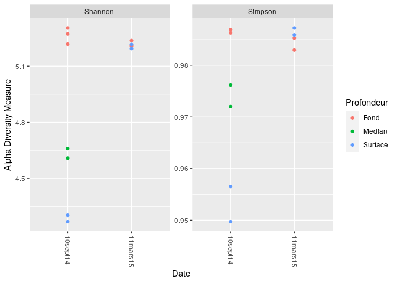<!-- -->

L’alpha diversité représente la diversité microbienne dans le même site
effectué selon différents indices.

L’indice de Shannon est sensible aux variations d’importance des espèces
les plus rares. Lorsque l’indice de Shannon est bas, cela signifie que
des espèces rares sont retrouvées plus facilement et qu’il y a une
espèce plus présente par rapport aux autres, par exemple pour la
surface le 10 septembre 2014, on a un indice de Shannon qui est
inférieur à 4,5. Pour le médian, un indice entre 4,5 et 4,8 et pour le
fond, un indice supérieur à 5,1. Cela signifie donc, il y a plus
d’espèces rares de manière croissante en partant du fond vers la
surface. En revanche, en mars 2015, l’indice de Shannon est supérieur à
5,1 qu’on se trouve en fond ou à la surface, ceci montre ainsi qu’il y a
peu d’espèce rare. Il y a donc une grande différence des espèces en
surface selon les deux dates. En effet il y a beaucoup plus d’espèces
rares en 2014. L’abondance en fond est donc mieux répartie.

L’indice de Simpson est sensibles aux variations d’importance des
espèces les plus abondantes. Lorsque l’indice de Simpson tend vers 0,
cela signifie que les échantillons représentent une grande diversité,
contrairement à 1 qui représente une faible diversité. Pour les
échantillons de 2014, les surfaces sont compris entre 0,96 et 0,95, les
médians entre 0,97 et 0,98 et enfin les fonds sont supérieurs à 0,98.
Les échantillons de la surface présentent une forte diversité par
rapport à ceux du fond, cependant, il faut prendre en compte que
l’indice de Simpson, que tout les échantillons tendent vers 1 et ne
sont donc pas significatifs. Il faudrait, pour cela effectuer des tests
statistiques. Pour mars 2015, tous les échantillons que ce soit au fond
ou en surface, les indices sont supérieurs à 0,98, ils présentent donc
une plus faible diversité. On voit bien qu’il y a une différence au
niveau de la diversité aux différents moments de l’année. Les résultats
avec l’indice de Shannon concordent avec ceux de l’indice de Simpson.

## Filtrage de la taxonomie

### Indiquer les rangs dans l’ensemble des données

La fonction rank-names: permet de déterminer les rangs taxonomiques de
ps

``` r
rank_names(taxa.print)
```

    ## [1] "Kingdom" "Phylum"  "Class"   "Order"   "Family"  "Genus"   "Species"

### Créer un tableau, nombre de caractéristiques pour chaque phyla

La fonction tax\_table : permet de construire et d’accéder à une table
de nom taxonomique de l’objet ps

Avec cette table, nous obtenons un tableau de contingence des différents
phyla. Le résultat indique le nombre de séquences appartenant au phylum
désigné. Les NA, c’est-à-dire ceux non assignés, sont des artefacts dans
le jeu de données, ils vont être supprimés. Les phyla les plus présents
sont les Proteobacteria et Bacteroidota.

``` r
table(tax_table(ps)[, "Phylum"], exclude = NULL)
```

    ## 
    ##              Actinobacteriota                  Bacteroidota 
    ##                            22                           238 
    ##              Bdellovibrionota              Campilobacterota 
    ##                            35                             1 
    ##                   Chloroflexi                 Crenarchaeota 
    ##                            21                             6 
    ##                 Cyanobacteria                  Dadabacteria 
    ##                           142                             3 
    ##                  Dependentiae              Desulfobacterota 
    ##                             1                             8 
    ##               Elusimicrobiota                Fibrobacterota 
    ##                             1                             2 
    ##               Gemmatimonadota               Hydrogenedentes 
    ##                             7                             1 
    ##              Margulisbacteria Marinimicrobia (SAR406 clade) 
    ##                            24                            81 
    ##                   Myxococcota                         NB1-j 
    ##                             5                             2 
    ##                  Nitrospinota                       PAUC34f 
    ##                            20                             3 
    ##               Planctomycetota                Proteobacteria 
    ##                            32                           786 
    ##  SAR324 clade(Marine group B)              Thermoplasmatota 
    ##                            16                            18 
    ##             Verrucomicrobiota                          <NA> 
    ##                            71                            11

### Créer une table avec le nombre dans chaque phyla

``` r
ps <- subset_taxa(ps, !is.na(Phylum) & !Phylum %in% c("", "uncharacterized"))
```

Toutes les séquences où le phylum n’a pas pu être caractérisé vont être
éliminés.

Les futures étapes vont permettre de définir la prévalence de chaques
caractéristiques

``` r
prevdf = apply(X = otu_table(ps),
               MARGIN = ifelse(taxa_are_rows(ps), yes = 1, no = 2),
               FUN = function(x){sum(x > 0)})
```

``` r
prevdf = data.frame(Prevalence = prevdf,
                    TotalAbundance = taxa_sums(ps),
                    tax_table(ps))
```

``` r
plyr::ddply(prevdf, "Phylum", function(df1){cbind(mean(df1$Prevalence),sum(df1$Prevalence))})
```

    ##                           Phylum        1    2
    ## 1               Actinobacteriota 3.727273   82
    ## 2                   Bacteroidota 3.978992  947
    ## 3               Bdellovibrionota 2.342857   82
    ## 4               Campilobacterota 2.000000    2
    ## 5                    Chloroflexi 4.238095   89
    ## 6                  Crenarchaeota 4.500000   27
    ## 7                  Cyanobacteria 3.204225  455
    ## 8                   Dadabacteria 4.666667   14
    ## 9                   Dependentiae 1.000000    1
    ## 10              Desulfobacterota 2.000000   16
    ## 11               Elusimicrobiota 1.000000    1
    ## 12                Fibrobacterota 2.500000    5
    ## 13               Gemmatimonadota 2.428571   17
    ## 14               Hydrogenedentes 1.000000    1
    ## 15              Margulisbacteria 1.833333   44
    ## 16 Marinimicrobia (SAR406 clade) 4.456790  361
    ## 17                   Myxococcota 2.400000   12
    ## 18                         NB1-j 1.500000    3
    ## 19                  Nitrospinota 3.950000   79
    ## 20                       PAUC34f 3.333333   10
    ## 21               Planctomycetota 3.437500  110
    ## 22                Proteobacteria 4.296438 3377
    ## 23  SAR324 clade(Marine group B) 4.687500   75
    ## 24              Thermoplasmatota 2.722222   49
    ## 25             Verrucomicrobiota 3.788732  269

La variable prevdf montre la prévalence dans notre jeu de données. On
calcul la prévalence de chaque caractéristiques de chaque data frame.

Les résultats obtenus en 1 et 2 sont : les prévalences totales (1) et
les moyennes (2)des caractéristiques de chaque embranchement

``` r
filterPhyla = c("Dependentiae", "Campilobacterota", "Elusimicrobiota", "Fibrobacterota", "Hydrogenedentes", "NB1-j")
```

On décide aussi d’éliminer tous les phyla qui ont été retrouvé un nombre
de fois inférieur à 10, car ils ne sont pas forcément représentatifs.

``` r
ps1 = subset_taxa(ps, !Phylum %in% filterPhyla)
ps1
```

    ## phyloseq-class experiment-level object
    ## otu_table()   OTU Table:         [ 1538 taxa and 11 samples ]
    ## sample_data() Sample Data:       [ 11 samples by 2 sample variables ]
    ## tax_table()   Taxonomy Table:    [ 1538 taxa by 7 taxonomic ranks ]
    ## phy_tree()    Phylogenetic Tree: [ 1538 tips and 1536 internal nodes ]

Une fois filtration faite, il ne reste plus que 1538 taxa parmi les 11
échantillons, on crée alors une nouvelles variable “ps1” sans les phyla
Dependentiae, Campilobacterota, Elusimicrobiota, Fibrobacterota,
Hydrogenedentes, NB1-j.

``` r
prevdf1 = subset(prevdf, Phylum %in% get_taxa_unique(ps1, "Phylum"))
ggplot(prevdf1, aes(TotalAbundance, Prevalence / nsamples(ps),color=Phylum)) +
  # Include a guess for parameter
  geom_hline(yintercept = 0.05, alpha = 0.5, linetype = 2) +  geom_point(size = 2, alpha = 0.7) +
  scale_x_log10() +  xlab("Total Abundance") + ylab("Prevalence [Frac. Samples]") +
  facet_wrap(~Phylum) + theme(legend.position="none")
```

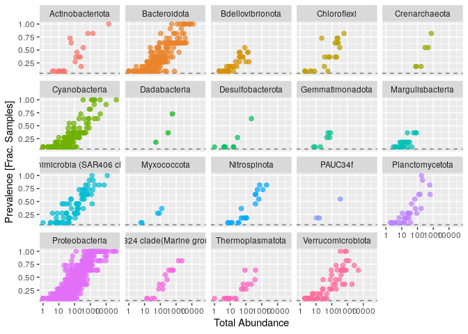<!-- -->

Les tableaux ci-dessus permettre de montrer la prévalence de chacun des
phyla selon l’abondance total. Cela correspond bien aux résultats
trouvés au dessus, les protéobacteries, les Bacteroidota sont fortement
présentes dans la population. Les cyanobactéries et les marinimicrobia
sont présentes en grande quantité également. Le problème avec la
prévalence, c’est que les échantillons sont mélangés et ne sont pas
classés en fonction de la date ou bien de la profondeur.

# Construction des arbres phylogénétiques

``` r
prevalenceThreshold = 0.05 * nsamples(ps)
prevalenceThreshold
```

    ## [1] 0.55

On définit le seuil de prévalence à 0,55

``` r
keepTaxa = rownames(prevdf1)[(prevdf1$Prevalence >= prevalenceThreshold)]
ps2 = prune_taxa(keepTaxa, ps)
```

``` r
length(get_taxa_unique(ps2, taxonomic.rank = "Genus"))
```

    ## [1] 104

On prend ps2 le filtrage et la prévalence, on lui assigne jusqu’au rang
«genre» les ASV. Obtenir la longueur des vecteurs de ps2.

``` r
ps3 = tax_glom(ps2, "Genus", NArm = TRUE)
```

Cette méthode permet de fusionner des espèces qui ont la même taxonomie
à un certain rang taxonomique, jusqu’au «genre» à partir de ps2, on
obtient alors ps3.

``` r
h1 = 0.4
ps4 = tip_glom(ps2, h = h1)
```

Toutes les pointes de l’arbre séparées par une distance inférieure à h
seront regroupés en un seul taxon. Donc h = 0,04

``` r
multiPlotTitleTextSize = 15
p2tree = plot_tree(ps2, method = "treeonly",
                   ladderize = "left",
                   title = "Before Agglomeration") +
  theme(plot.title = element_text(size = multiPlotTitleTextSize))
p3tree = plot_tree(ps3, method = "treeonly",
                   ladderize = "left", title = "By Genus") +
  theme(plot.title = element_text(size = multiPlotTitleTextSize))
p4tree = plot_tree(ps4, method = "treeonly",
                   ladderize = "left", title = "By Height") +
  theme(plot.title = element_text(size = multiPlotTitleTextSize))
```

``` r
gridExtra::grid.arrange(nrow = 1, p2tree, p3tree, p4tree)
```

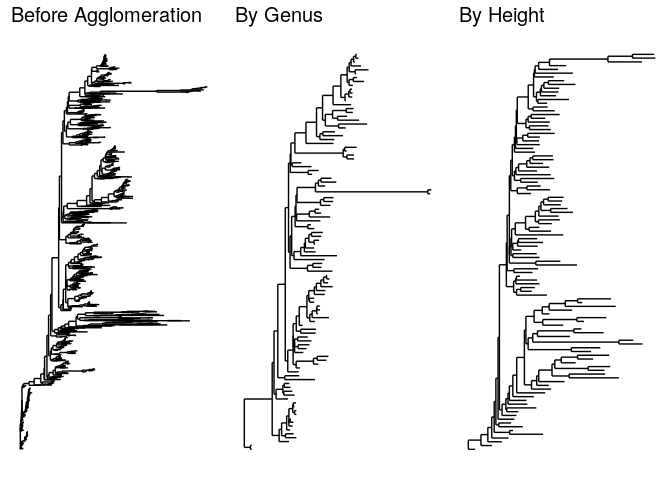<!-- -->

La construction des arbres montre la variété des OTU retrouvés dans la
rade de Brest et de leur distance phylogénétique en eux.

# Abondance

## Selon la profondeur

Tout d’abord, nous pouvons voir de manière graphique la répartition et
l’abondance d’un phylum choisi selon la profondeur, en l’occurence
Planctomycetota dans tous les taxons retrouvés.

``` r
plot_abundance_P = function(physeq,title = "",
                          Facet = "Order", Color = "Phylum"){
  # Arbitrary subset, based on Phylum, for plotting
  p1f = subset_taxa(physeq, Phylum %in% c("Planctomycetota"))
  mphyseq = psmelt(p1f)
  mphyseq <- subset(mphyseq, Abundance > 0)
  ggplot(data = mphyseq, mapping = aes_string(x = "Profondeur",y = "Abundance",
                              color = Color, fill = Color)) +
    geom_violin(fill = NA) +
    geom_point(size = 1, alpha = 0.3,
               position = position_jitter(width = 0.3)) +
    facet_wrap(facets = Facet) + scale_y_log10()+
    theme(legend.position="none")
}
```

``` r
ps3ra_P = transform_sample_counts(ps3, function(x){x / sum(x)})
```

``` r
plotBefore_P = plot_abundance_P(ps3,"")
plotAfter_P = plot_abundance_P(ps3ra_P,"")
```

``` r
gridExtra::grid.arrange(nrow = 1, plotBefore_P, plotAfter_P)
```

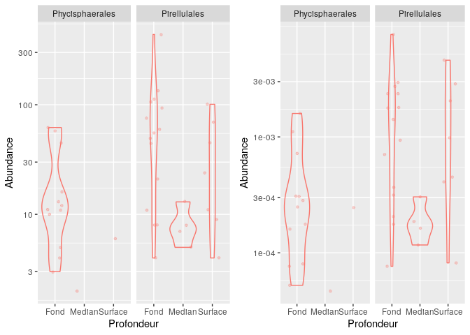<!-- -->

Les premiers graphiques représentent l’abondance initale et les seconds,
représentent l’abondance relative selon la profondeur. Deux classes ont
découverts : les Phycisphaerales et les Pirellulales.

Les deux classes sont présentes dans les même proportions selon les
profondeurs que ce soit avec l’abondance initiale ou l’abondance
relative. Par contre, les Phycisphaerales ne sont présents que dans le
fond, elles sont très peu présentes dans les autres niveaux de
profondeur. Les Pirellulales sont abondantes dans le fond et en surface,
mais assez peu au niveau médian.

``` r
psOrd_P = subset_taxa(ps3ra_P, Order == "Pirellulales")
plot_abundance_P(psOrd_P, Facet = "Genus", Color = NULL)
```

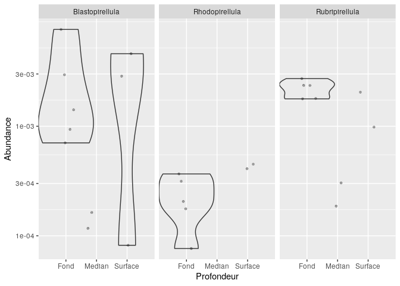<!-- -->

Chez les Pirellulales, trois ordres ont été retrouvés : les
Blastopirellula, les Rhodopirellula, les Rubripirellula. Le premier
ordre est très abondantes dans le fond et à la surface. Le second ordre
est présent significativement dans le fond mais reste inférieur à
l’abondance du troisième ordre cité dans le fond. Les Rhodopirellula
et les Rubripirellula ne sont présentes significativement dans le fond.

# Ordination

``` r
# Transform data to proportions as appropriate for Bray-Curtis distances
ps.prop <- transform_sample_counts(ps, function(tax_table) tax_table/sum(tax_table))
ord.pcoa.bray <- ordinate(ps.prop, method="PCoA", distance="bray")
```

## Visualisation de l’ordination

``` r
plot_ordination(ps.prop, ord.pcoa.bray, color="Profondeur", shape = "Date", title="Bray PCoA")
```

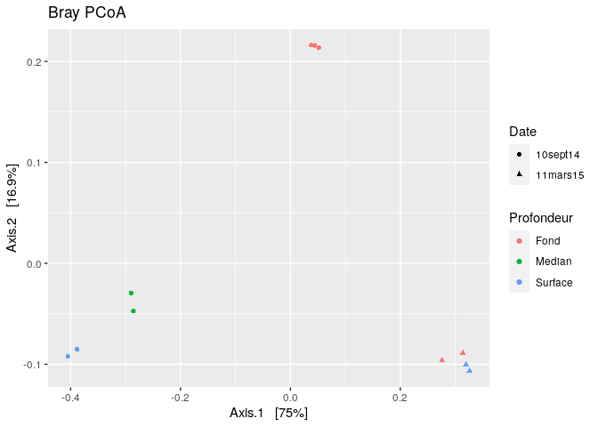<!-- -->

L’interprétation d’un tracé de PCoA est simple : les objets ordonnés
plus près les uns des autres sont plus similaires que ceux ordonnés plus
loin. La (dés) similitude est définie par la mesure utilisée dans la
construction de la matrice de (dés)similitude utilisée en entrée. Les
valeurs négatives correspondent à des nombres imaginaires sont générés
lors de l’analyse et empêchent la représentation euclidiennes.

Analyse :

En mars 2015 (triangles), les points représentants les échantillons
provenants du fond et de la surface sont très proches. Cela signifie que
lors de l’échantillonnage, la diversité des OTU était quasiment la même.
En revanche, ce n’est pas le cas pour septembre 2014, les points,
représentants les différentes profondeurs sont très éloignés les uns
les autres traduisant une population diversifiée à chaque niveau de
profondeur. Les échantillons du médian et de la surface sont de tout de
même assez proches contrairement aux points représentant les
échantillons provenant du fond qui est totalement éloigné des autres
points. Cela traduit donc un désaccord au niveau des OTU retrouvés.

En comparant les points entre les dates, pour la surface, les OTU
semblent très éloignés entre eux. Cela montre ainsi que selon la saison,
la diversité change totalement. Nous constatons cette importante
différence pour les échantillons provenant du fond.

# Bar plot

## Au niveau du Phylum

``` r
top20 <- names(sort(taxa_sums(ps), decreasing=TRUE))[1:20]
ps.top20 <- transform_sample_counts(ps, function(OTU) OTU/sum(OTU))
ps.top20 <- prune_taxa(top20, ps.top20)
plot_bar(ps.top20, x="Date", fill="Phylum", title="Diversité des Phyla les plus abondants") + facet_wrap(~Profondeur, scales="free_x")
```

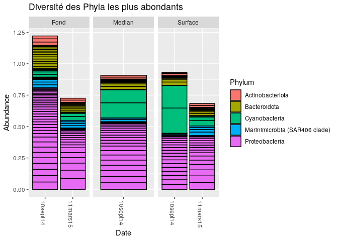<!-- -->

Le phylum des Cyanobactéries se retrouve principalement en surface et en
zone médiane, cela s’explique par le fait que ces bactéries, pour leur
croissance, ont besoin de lumière, ce qui est cohérent. En septembre, il
est normal de retrouver plus de cyanobactéries comparé au mois mars
puisque l’été synonyme de soleil est passé. Ces bactéries ont plus eu le
temps de se développer.

La majorité des communautés est représentée par le phylum de
Proteobacteria. Dans la table taxa.print, ces Protéobactéries sont
subdivisées en deux groupes retrouvés : les alphaprotéobactéries et les
gammaprotéobactéries. Ces dernières peuvent se retrouver dans les
intestins, mais aussi dans l’eau de pluie. Le temps breton étant propice
aux intempéries pluvieuses, il serait donc normal de retrouver ce type
de bactéries.

L’abondance des communautés retrouvée en mars 2015 que ce soit au fond
ou en surface, garde la même tendance et les mêmes proportions.C’est
cohérent avec la PCoA effectuée précédemment. Concernant les
échantillonnages de septembre 2014, dans le fond, parmi les espèces les
plus abondantes le phylum Bacteroidota est présent en plus forte
quantité. Pour le niveau médian et la surface, le niveau d’abondance
est sensiblement le même. C’est cependant au niveau des phyla
Cyanobacteria, Marinimicrobia qu’une variation est visible. Ici encore,
ceci correspond aux résultats étudiés lors de la PCoA.

``` r
top20 <- names(sort(taxa_sums(ps), decreasing=TRUE))[175:178]
ps.top20 <- transform_sample_counts(ps, function(OTU) OTU/sum(OTU))
ps.top20 <- prune_taxa(top20, ps.top20)
plot_bar(ps.top20, x="Date", fill="Phylum", title="Observation des Phyla pour observer les Crenarchaeota") + facet_wrap(~Profondeur, scales="free_x")
```

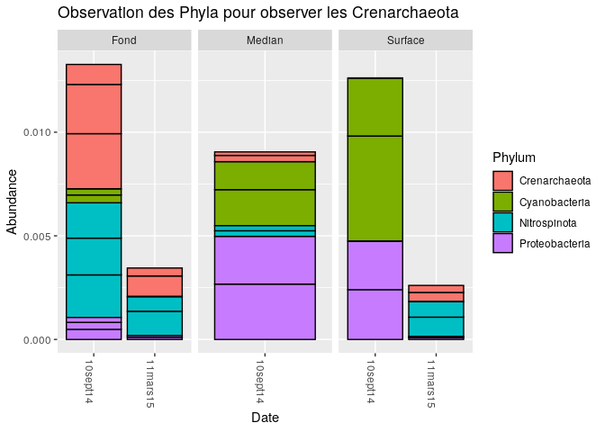<!-- -->

``` r
top20 <- names(sort(taxa_sums(ps), decreasing=TRUE))[283:285]
ps.top20 <- transform_sample_counts(ps, function(OTU) OTU/sum(OTU))
ps.top20 <- prune_taxa(top20, ps.top20)
plot_bar(ps.top20, x="Date", fill="Phylum", title="Observation des Phyla pour observer les Thermoplasmatota") + facet_wrap(~Profondeur, scales="free_x")
```

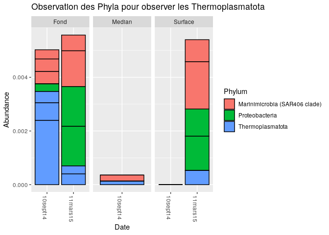<!-- -->

Les deux derniers bar plot servent à indiquer à quelle profondeur se
situe les phyla des archées Crenarchaeota et Thermoplasmatota. Nous
voyons qu’elles sont plus présentes dans le fond pour les deux années,
assez peu au niveau médian et sont présentes en plus grande quantité que
le médian, mais reste inférieures à celles du fond. De plus, en surface,
les archées ne sont présentes qu’en mars 2015.

Pour l’année 2014, le fond a présenté une plus grande quantité de phyla
d’archée contrairement à mars 2015, qui peut être expliqué par le fait
qu’une partie de cette population se retrouve en surface.

``` r
top20 <- names(sort(taxa_sums(ps), decreasing=TRUE))[1:20]
ps.top20 <- transform_sample_counts(ps, function(OTU) OTU/sum(OTU))
ps.top20 <- prune_taxa(top20, ps.top20)
plot_bar(ps.top20, x="Date", fill="Genus") + facet_wrap(~Profondeur, scales="free_x")
```

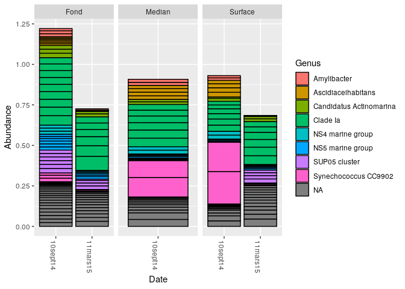<!-- -->

Pour le médian, on trouve en majorité le cladIa , puis les Synechoccocus
CC9902 (rose) avec les Ascidiceihabitans (marron) dans des proportions
équivalentes. Pour la surface, les Synechoccocus CC9902 dominent en
septembre alors que c’est le clade IA en mars. Le deuxième genre
majoritaire en septembre est le clade IA, alors que pour mars, c’est des
SUP05 cluster. Sachant qu’il y a une grande proportion de non
caractériser. Pour mars 2015, les Ascidiaceihabitans et les
Synechoccocus CC9902 ne sont plus présents. Pour le fond de la rade de
Brest pour les deux dates, on retrouve en plus grande proportion le
genre de clade Ia (vert), puis en plus petite quantité les SUP05 cluster
(violet) et après les NS5 marine group (bleu). Sachant qu’il y a une
grande proportion dans les deux cas de NA.

En ce qui concerne le fond, hormis le fait qu’il n’y ait plus la
présence d’Amylibacter en 2015, les genres retrouvés sont les mêmes à
des abondances plus faibles, mais restent proportionnelles. Globalement,
on a un genre qui se trouve dans n’importe qu’elle profondeur qu’elle
que soit la date, c’est le cladeIa. La seule différente entre les dates
que l’on peut noter pour les genres est dans la surface. En effet ce
sont les Synechoccocus CC9902 qui domine en septembre.

# Analyse en réseau

``` r
library(dada2)
library(phyloseq)
library(ggplot2)
library(dplyr)
```

    ## 
    ## Attaching package: 'dplyr'

    ## The following objects are masked from 'package:Biostrings':
    ## 
    ##     collapse, intersect, setdiff, setequal, union

    ## The following object is masked from 'package:XVector':
    ## 
    ##     slice

    ## The following objects are masked from 'package:IRanges':
    ## 
    ##     collapse, desc, intersect, setdiff, slice, union

    ## The following objects are masked from 'package:S4Vectors':
    ## 
    ##     first, intersect, rename, setdiff, setequal, union

    ## The following objects are masked from 'package:BiocGenerics':
    ## 
    ##     combine, intersect, setdiff, union

    ## The following objects are masked from 'package:stats':
    ## 
    ##     filter, lag

    ## The following objects are masked from 'package:base':
    ## 
    ##     intersect, setdiff, setequal, union

``` r
library(reshape2)
library(ade4)
```

    ## 
    ## Attaching package: 'ade4'

    ## The following object is masked from 'package:Biostrings':
    ## 
    ##     score

    ## The following object is masked from 'package:BiocGenerics':
    ## 
    ##     score

``` r
library(ggrepel)
library(lattice)
library(caret)
library(igraph)
```

    ## 
    ## Attaching package: 'igraph'

    ## The following objects are masked from 'package:dplyr':
    ## 
    ##     as_data_frame, groups, union

    ## The following objects are masked from 'package:ape':
    ## 
    ##     edges, mst, ring

    ## The following object is masked from 'package:Biostrings':
    ## 
    ##     union

    ## The following object is masked from 'package:IRanges':
    ## 
    ##     union

    ## The following object is masked from 'package:S4Vectors':
    ## 
    ##     union

    ## The following objects are masked from 'package:BiocGenerics':
    ## 
    ##     normalize, path, union

    ## The following objects are masked from 'package:stats':
    ## 
    ##     decompose, spectrum

    ## The following object is masked from 'package:base':
    ## 
    ##     union

``` r
library(ggnetwork)
```

``` r
net <- make_network(ps, max.dist=0.35)
sampledata <- data.frame(sample_data(ps))
V(net)$date <- sampledata[names(V(net)), "Date"]
V(net)$Profondeur <- sampledata[names(V(net)), "Profondeur"]

net_graph <- ggnetwork(net)

ggplot(net_graph, aes(x = x, y = y, xend = xend, yend = yend), layout = "fruchtermanreingold") +
  geom_edges(color = "darkgray") +
  geom_nodes(aes(color = date, shape = Profondeur),  size = 3 ) +
  theme(axis.text = element_blank(), axis.title = element_blank(),
        legend.key.height = unit(0.5,"line")) +
  guides(col = guide_legend(override.aes = list(size = .5)))
```

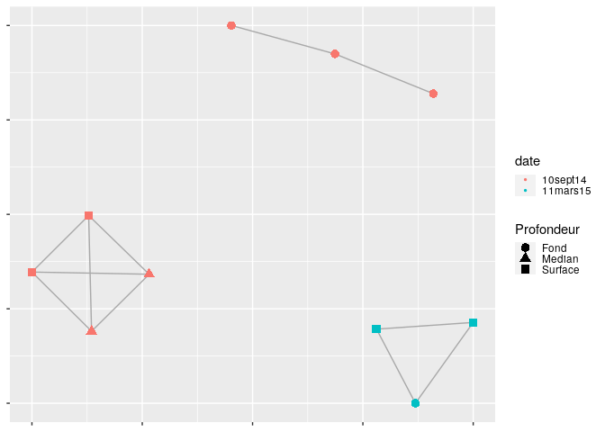<!-- -->

Cette analyse en réseau permet de voir la liaison entre les
échantillons. Les points bleus représentant mars 2015, sont liés entre
eux entre le fond et la surface. Les communautés microbiennes sont donc
proches phylogénétiquement. Contrairement aux échantillons prélevés en
septembre 2014, où deux communautés sont bien distinctes, séparés donc
en deux groupes éloignés. Les échantillons provenant du fond et de la
surface présente tout de même un lien. En revanche, le fond, lors de
cette année présentes des communautés particulières, totalement
différentes des deux autres profondeurs.

L’analyse correspond aux résultats observés avec l’ordination de la
PCoA.

Finalement, nous avons pu observer que les communautés microbiennes
évoluaient en fonction de la profondeur et des dates que l’on peut
expliquer avec des suppositions.

Nous pouvons émettre plusieurs hypothèses possibles suite à ces
variations :

  - Au début de l’année 2014, de nombreuses tempêtes ont fait rage au
    large de la Bretagne, il y a pu avoir une répercussion au niveau de
    la diversité des OTU échantillonnées en septembre.
  - Le Gulf Stream passe près de la Bretagne, ce courant peu apporter de
    nouvelles espèces provenant du Nord.
  - Avec le réchauffement climatique, la température de la mer,
    notamment au niveau de la surface peu modifier le milieu et donc
    avoir un changement au niveau des communautés bactériennes.
  - La rade de Brest possède une grande activité maritime : commerciale
    et militaire. Il est possible qu’avec ces échanges, les bateaux
    importent ou exportent diverses communautés bactériennes.
